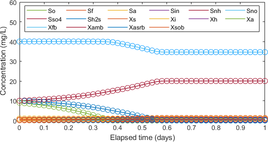

# CWM1-matlab

## A MATLAB implementation of Constructed Wetland Model 1 (CWM1) for reactive–transport simulators

The Constructed Wetland Model 1 (CWM1) is a general model which describes the biochemical transformation/degradation processes for organic matter, nitrogen and sulphur in constructed wetlands (Langergraber et al. 2009 [[1]](#1)).

This code is designed to be coupled with a fluid flow and chemical species transport simulator. Both for horizontal flow (HFCW) and vertical flow (VFCW) constructed wetlands the transport simulator usually consists of a flow model (Richards' equation or Darcy's law) and transport of particulates and solutes (advection-dispersion equation).

The model includes the interpolation of some temperature-dependent parameters af a function of the water temperature with the method suggested by Henze et al. 2006 [[2]](#2).

The CWM1 model consists of 17 processes (reactions) and 16 components (8 soluble and 8 particulate) which are represented by a system of ordinary differential equations (ODEs). The ODEs are solved using an explicit Runge-Kutta (2,3) method (`ode23` MATLAB function).

## Usage

To run a simulation, the function `cwm1.m` can be called as follows:

```matlab
C = cwm1(dt,params,init_cond)
```

The function takes the following inputs:

- `dt`: simulation duration.
- `params`: vector of model parameters. See `parameters.m` file.
- `init_cond`: matrix [Nx16] of initial conditions, where N is the number of instances and 16 is the number of components of the CWM1 model

As the function is meant to be coupled with a transport code (e.g., using a sequential non-iterative approach, SNIA), `dt` corresponds to the coupling step interval. `N` is the number of instances, i.e., the number of mesh nodes of the coupled transport model.

The function returns a matrix of concentrations `C` of the final state of the `ode23` solver. Intermediate steps taken by the solver are discarded.

## MEX function

The `cwm1` is also made available as mex executables which are able to significantly increase the execution speed (> 5x faster than the .m file).
Two versions are available in the release section:

- `cwm1_mex.mexa64`: x86_64 Linux version, compiled with MATLAB R2019a on Ubuntu 18.04.4.
- `cwm1_mex.mexw64`: x86_64 Windows version, compiled with MATLAB R2019b  on Windows 10.

The compatibility with other systems is not guaranteed. The user is advised to build a specific executable with MATLAB Coder.

## Benchmark

The file `main.m` shows an example of CWM1-MATLAB usage. The routine performs a speed comparison between plain MATLAB code and compiled .mex files.
The routine also performs the validation of the code by comparison with CWM1 implemented in the PHREEQC software by Boog et al. 2018 [[3]](#3).



The lines represent the simulated concentrations and circles represent the results from the PHREEQC model.

While the PHREEQC model coupled to transport simulators (e.g., using PhreeqcRM module) is much more flexible for simulating a wide range of bio-chemical systems, the CWM1-matlab routine has the advantage to be significantly faster; this is crucial especially when the number of model instances is large (e.g., 2D/3D models).


## References

<a id="1">[1]</a> Langergraber, G., Rousseau, D. P., García, J., & Mena, J. (2009). CWM1: a general model to describe biokinetic processes in subsurface flow constructed wetlands. *Water Science and Technology*, *59*(9), 1687-1697. DOI: [10.2166/wst.2009.131](https://doi.org/10.2166/wst.2009.131)

<a id="2">[2]</a> Henze, M., Gujer, W., Mino, T., & van Loosdrecht, M. C. (2006). Activated Sludge Models ASM1, ASM2, ASM2d and ASM3. *IWA publishing*. ISBN (book): 9781900222242. DOI: [10.2166/9781780402369](https://doi.org/10.2166/9781780402369)

<a id="3">[3]</a> Boog, J. (2018). Application: Treatment Wetlands. In *OpenGeoSys Tutorial* (pp. 63-90). SpringerBriefs in Earth System Sciences. Springer, Cham. DOI: [10.1007/978-3-319-67153-6_7](https://doi.org/10.1007/978-3-319-67153-6_7)
